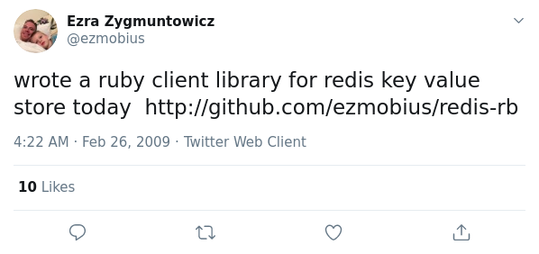

2020-09-23
Treviso

Daniele Baggio
@baxtheman

https://www.eventbrite.it/e/biglietti-piu-potere-per-la-tua-applicazione-se-usi-redis-118820674837

https://textart.io/sequence
http://stable.ascii-flow.appspot.com/#Draw

# Più potere per la tua applicazione se usi REDIS (?)

`Io con MySql ciu faccio di tutto, e chemmefrega di altri pseudo database?.....`

## Remote Dictionary Server

- https://redis.io/  
- https://github.com/redis/redis

- first released on May 10, 2009; see https://news.ycombinator.com/item?id=494649

- "Redis in action" book published in 2013 (version 2.8, now is 6.0)

- BSD-licensed open-source, 45K GitHub stars 

- written in C language by Salvatore Sanfillipo @antirez (Catania)

- IN MEMORY

- The data model is key-value

- RDBMS is hard to scale, REDIS is born for that

- many different kind of values are supported: Strings, Lists, Sets, Sorted Sets, Hashes, Streams, HyperLogLogs, Bitmaps

- atomic operations

- can persist on disk

- Redis is a NoSQL database system

- no native GUI, only CLI

- Early adopted by Ruby on rails community to scale web sites 
,

## Large adoption

- Instagram, Twitter, Github
- Uber Airbnb Pinterest Udemy Hey Patreon
 Shopify Slack Instacart Trello Imgur
Weibo Snapchat Craigslist Digg StackOverflow Kickstarter ....
- Youporn (2003), see https://i.imgur.com/i38JMQa.png

- Redis is the most popular key-value store on the planet (?), see https://i.imgur.com/Bh9BGRR.png
- Redis has 10 years story
- Redis lives through NoSql war

## Look inside

    redis-server.exe
    redis.conf

	redis-cli.exe
	redis-benchmark.exe

## Simple DEMO

.........

## Is a database?

- What is a database for you?

- It's a standalone server, cannot 'embedded' in application (sqllite)

- Redis: 
	- non safe but VERY efficient
	- many data structures & many manipulation commands

- Typical RDBMS: 
	- safe but not very efficient
	- single data model, only insert/update/delete

- Redis is not a transactional database (no ACID)
- There is no rollback
- Redis has no concurrency problem (dirty read, lost update,..)

- Isolation is always guaranteed at command level

- Foreign key? Referential Integrity? FORGET! 

## Communication

- A client connects to a Redis server creating a TCP connection to the port 6379.

- NO HTTP

- a protocol called RESP (REdis Serialization Protocol). While the protocol was designed specifically for Redis
- RESP is binary-safe (value is binary safe)

- simple request-response protocol (with some exceptions)
- pipelining , Pub/Sub channel (push protocol)

## Clients

- redis-cli is the first, the standard, the complete coverage client for redis
- redis-cli is the best tool to understand redis

- language sdk list:

	ActionScript ActiveX/COM+ Bash Boomi 
	C C# C++ 
	Clojure Common Lisp Crystal D Dart Delphi Elixir emacs lisp Erlang Fancy gawk GNU Prolog Go Haskell Haxe Io 
	Java 
	Julia Lasso Lua Matlab mruby Nim 
	Node.js 
	Objective-C OCaml Pascal Perl PHP PL/SQL Pure Data 
	Python 
	R Racket Rebol Ruby Rust Scala Scheme Smalltalk Swift Tcl VB VCL Xojo Zig

- For popular languages, there are many choices
- for same language... different client library different behavior **ATTENTION**  
- pay attention to value handling

## Commands & Data structues

- every command is an atomic operation, No parallel executions

- value is a binary safe string

- key max size is 512MB

- value max size is 512MB

### Note: open the redis-cli, try commands

### INFO

PING
INFO

### STRINGS

APPEND, BITCOUNT, BITFIELD, BITOP, BITPOS, DECR, DECRBY, GET, GETBIT, GETRANGE, GETSET, INCR, INCRBY, INCRBYFLOAT, MGET, MSET, MSETNX, PSETEX, SET, SETBIT, SETEX, SETNX, SETRANGE, STRLEN

highlights:

	SET key1 susanna
	GET key1
	> susanna
	DEL key1

	SET user45 "session expire in a minute" EX 60

	EXISTS user45
	> 1
	EXISTS user45
	> 0

### LIST (L prefix)

-  List implemented using a Linked List (fast for head & tail)

BLPOP, BRPOP, BRPOPLPUSH, LINDEX, LINSERT, LLEN, LPOP, LPUSH, LPUSHX, LRANGE, LREM, LSET, LTRIM, RPOP, RPOPLPUSH, RPUSH, RPUSHX

highlights:

	LPUSH list1 1 2 3 4
	RPOP list1
	> 1
	RPOP list1
	> 2

	BRPOPLPUSH list1 list2

### SET (S prefix)

- Sets are lists for unique objects

SADD, SCARD, SDIFF, SDIFFSTORE, SINTER, SINTERSTORE, SISMEMBER, SMEMBERS, SMOVE, SPOP, SRANDMEMBER, SREM, SSCAN, SUNION, SUNIONSTORE

### HASH (H prefx)

	key {
		subkey1 : value1
		subkey2 : value2
		subkey3 : value3
	}

HDEL, HEXISTS, HGET, HGETALL, HINCRBY, HINCRBYFLOAT, HKEYS, HLEN, HMGET, HMSET, HSCAN, HSET, HSETNX, HSTRLEN, HVALS

	> hmset user:1000 username antirez birthyear 1977 verified 1
	OK
	> hget user:1000 username
	"antirez"
	> hget user:1000 birthyear
	"1977"
	> hgetall user:1000
	1) "username"
	2) "antirez"
	3) "birthyear"
	4) "1977"
	5) "verified"
	6) "1"

- Note: Redis hash cannot store json

### GEO commands

_offtopic_

## Benchmark?

	$ ./redis-benchmark.exe -d 500 -t set -c 10
	====== SET ======
	100000 requests completed in 1.14 seconds
	10 parallel clients
	500 bytes payload
	keep alive: 1

	87336.24 requests per second

	$ ./redis-benchmark.exe -d 500 -t set -c 1
	====== SET ======
	100000 requests completed in 4.66 seconds
	1 parallel clients
	500 bytes payload
	keep alive: 1

	21454.63 requests per second

_Note: When latency > throughput, you need multiple requests in flight to bottleneck on throughput instead of just round-trip latency._

	$ ./redis-cli --latency
	min: 0, max: 2, avg: 0.30 (1985 samples)

(i5 2.8Ghz)

## Memory

- An empty instance uses ~ 3MB of memory.  *I LIKE*

- 1 Million Keys -> Hash value, representing an object with 5 fields, use ~ 160 MB of memory

- no more physical memory? usually the server will start swapping...

- max limit to memory usage by conf (f this limit is reached Redis will start to reply with an error)

- SET / GET key with string value
Strings, which can contain any data type, are considered binary safe and have a maximum length of 512MB

## How is made

- ANSI C only

- Works in most POSIX systems like Linux, xBSD, OS X

- There is no official support for Windows builds (_last version for Windows is 3.6, instead use docker_)

- Redis operates as a single process and is single-threaded *I LIKE*

- A single Redis instance CANNOT USE parallel execution of tasks

- all atomic operations *I LIKE*

### Transactions

- execution of a group of commands in a single step, with two important guarantees:

	- All the commands in a transaction are serialized and executed sequentially
	- Either all of the commands or none are processed
	- so a Redis transaction is also atomic

	> MULTI
	OK
	> INCR foo
	QUEUED
	> INCR bar
	QUEUED
	> EXEC
	1) (integer) 1
	2) (integer) 1

## Extensions _offtopic_

- Redis can load Lua scriptS to perform internal data manipulation
- there is Lua module to manage JSON data
- there is Lua module to build neural network..
- there is Lua module to manage geospatial or custom data models
- search by yourself...

## Persistence

- volatile memory first, hard disk later (if you need)

- Redis offers two ways to persist your data:
	- Dumping in-memory data to disk in compact format.
	- Write/append a file with every commands which alters the data on Redis

## Security

- Redis is designed to be accessed by trusted clients inside trusted environments.

redis.conf
	bind 127.0.0.1

- optional tiny layer of authentication 

	AUTH password

- NO ACL

- optional TLS support

## High availability (offtopic)

- Partitioning
- Cluster
- Instrumenting... 

__offtopic__

### Pub/Sub 

- Redis is a fast and stable Publish/Subscribe messaging system *I LIKE*

- pretty simple pub/sub

- Redis is the broker, clients are publisher or receivers

- Only connected clients receive notification (no retention)

- PUB/SUB + LIST to have Scheduled-task pattern

- key is the topic, value is the message

object Prod Redis Cons1 Cons2
Prod->Redis: Push data (+ publish)

    |               |         |         |
    | Push data     |         |         |
    |-------------->|         |         |
    |               |         |         |
    | Push data     |         |         |
    |-------------->|         |         |
    |               |         |         |
    | Publish       |         |         |
    |-------------->|         |         |
    |               |         |         |
=======

**DEMO TIME**

## Whe want use cases !!

### Mine

- Legacy application, a new hope

- Scheduled-task pattern: use the right language to perform the task

### Classics

- Session Cache: Many websites leverage Redis Strings to create a session cache to speed up their website experience 

- User Profiles: Many web applications use Redis Hashes for their user profiles

- Basic Rate Limiting: Building a rate limiter with Redis is an easy because of two commands INCR and EXPIRE. The basic concept is that you want to limit requests to a particular service in a given time period. 

- Distributed job queue is a very popular pattern to process heavy batch work, which can require much 'bigger' (read: expensive) hardware resource to complete. One of the most popular ways to implement a queue is by using three Redis list for waiting, processing and dead letter queue.

- Leaderboards: Forums like Reddit and other voting platforms leverage Redis Lists to add articles to the leaderboard and sort by most voted entries.

- Many online stores use Redis Sets to analyze customer behavior, such as searches or purchases for a specific product category or subcategory

- Redis Sets are a great tool for developers who want to analyze all of the IP addresses that visited a specific website

- User Posts: Social platforms like Instagram leverage Redis Hashes to map all the archived user photos or posts back to a single user. The hashing mechanism allows them to look up and return values very quickly, fit the data in memory, and leverage data persistence in the event one of their servers dies.

- Q&A Platforms: Many Q&A platforms like Stack Overflow and Quora use Redis Sorted Sets to rank the highest voted answers for each proposed question to ensure the best quality content is listed at the top of the page.